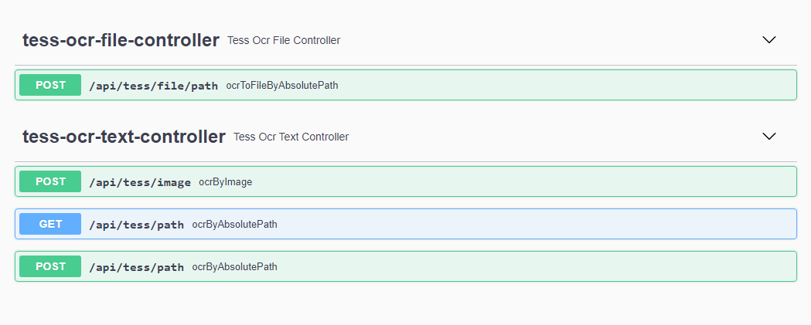
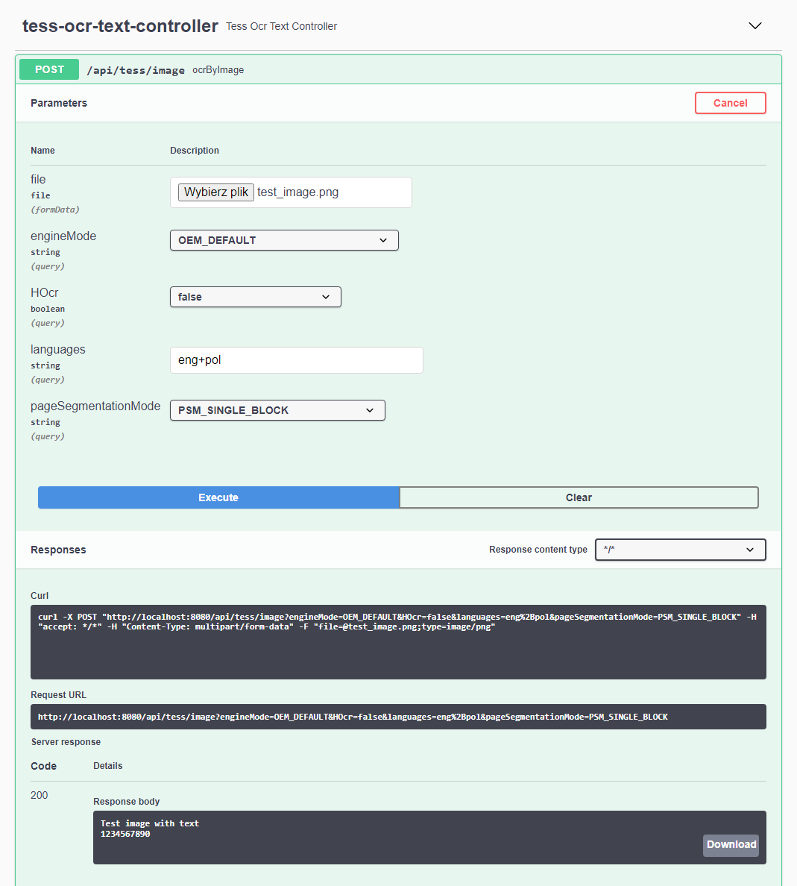

# ocr-examples

OCR examples with Tesseract

## Features

### API for testing Tesseract

* OCR image by absolute path to file
* OCR image by sending file
* Selecting Tesseract engine mode and page segmentation mode
* Return result in text or HOcr
* Specifying languages (missing dictionaries will be automatically downloaded)
* Saving a file after OCR (text file, PDF with text layer)

Look at Swagger for details: http://localhost:8080/swagger-ui/

<sup>You have to have running application locally - see below.</sup>





### Examples of usage

* The simplest usage of Tesseract
* Generating HOcr
* OCR from PDF file using PDFBox

Look at test folder for details: [pl.marcinkowalczyk.ocr.examples.tesseract](src/test/java/pl/marcinkowalczyk/ocr/examples/tesseract).

## Running

Prerequisites: installed JDK 11.

1. Build application:
    - Linux: `./mvnw clean package` 
    - Windows: `mvnw.cmd clean package`  
2. Run application: `java -jar target/ocr-examples-0.0.1-SNAPSHOT.jar`
3. Open browser with URL: http://localhost:8080/

## Usage

### Simple usage

Send HTTP request. Provide an absolute path to an image file for OCR as a parameter.
```
http://localhost:8080/api/tess/path?absolute=<absolute_path_to_image_file>
```

Example:
```
http://localhost:8080/api/tess/path?absolute=C:/dev/ocr/ocr-examples/src/test/resources/test_image.png
```

### Swagger

For more endpoints and parameters explore Swagger: http://localhost:8080/swagger-ui/